# Лабораторна робота №3. Вкладені цикли та розгалуження. Побудова псевдографічних геометричних фігур у консолі

## Мета роботи

Опанування алгоритмічних конструкцій вкладених циклів (`nested loops`) та умовних операторів (`if-else`) з комплексними умовами у мові програмування С++; набуття практичних навичок їх використання на прикладі реалізації алгоритмів виведення складних псевдографічних геометричних фігур у консоль, а також валідації вхідних геометричних параметрів.

## Задачі роботи

1. Дослідити механізм роботи вкладених циклів `for` для формування двовимірного консольного растра (рядки $row$ та стовпці $col$).
2. Навчитися визначати та описувати мовою логічних виразів рівняння прямих, діагоналей і півплощин у дискретній системі координат матриці розміром $N \times N$.
3. Опанувати сполучення логічних операторів `&&` (І), `||` (АБО), `!` (НІ) для побудови складних умов у розгалуженнях `if` (на прикладі побудови геометричних фігур та комбінованих контурів).
4. Дослідити реалізацію задачі-прикладу (Варіант 0 — прямокутний трикутник) та виконати самостійно призначений індивідуальний варіант.
5. Побудувати графічну схему алгоритму (draw.io, Visio, Mermaid).
6. Провести тестування програми на щонайменше 5 різнопланових тестових наборах (включаючи типові, межові та виняткові випадки).

## Перелік індивідуальних варіантів завдання

> **Загальні вимоги до виконання завдання:**
> Розмір фігури ($N$ — висота/ширина або сторона квадрата) задається користувачем з клавіатури.  Фігура відображається у консолі за допомогою символу `*` (зірочка) для заповнених ділянок та пробілу `' '` для порожніх ділянок. Координатна сітка розглядається як матриця $N \times N$, де рядок $row \in [0, N-1]$, стовпець $col \in [0, N-1]$ (нумерація зверху вниз та зліва направо).

| № | Індивідуальне завдання | Зображення |
| ---: | --- | --- |
| **0** | **Базовий демонстраційний варіант:** Побудувати прямокутник розміром $N \times N$ із заповненням у лівому нижньому куті  (під головною діагоналлю, $row \le col$)). | 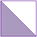 |
| **1** | Побудувати прямокутник розміром $N \times N$ із заповненням у правому верхньому куті  (над головною діагоналлю, $row \ge col$)). | 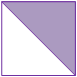 |
| **2** | Верхній сектор («стрілка» вниз) у квадраті $N \times N$: область, обмежена діагоналями зверху (верхній трикутник між головною та побічною діагоналями: $row \le col$ та $row + col \le N - 1$). |  |
| **3** | Нижній сектор («стрілка» вгору) у квадраті $N \times N$: область, обмежена діагоналями знизу (нижній трикутник: $row \ge col$ та $row + col \ge N - 1$). | 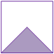 |
| **4** | Верхній сектор та нижній сектор (вертикальний «пісочний годинник») у квадраті $N \times N$: область у вигляді верхнього та нижнього трикутників між діагоналями. | 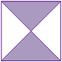 |
| **5** | Лівий сектор та правий сектор (горизонтальний «метелик») у квадраті $N \times N$: область у вигляді лівого та правого трикутників між діагоналями. |  |
| **6** | Лівий сектор («стрілка» праворуч) у квадраті $N \times N$: область у вигляді трикутника між головною та побічною діагоналями ліворуч ($row \ge col$ та $row + col \le N - 1$). |  |
| **7** | Правий сектор («стрілка» ліворуч) у квадраті $N \times N$: область у вигляді трикутника між головною та побічною діагоналями праворуч ($row \le col$ та $row + col \ge N - 1$). | 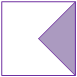 |
| **8** | Побудувати прямокутник розміром $N \times N$ із заповненням у лівому верхньому куті (область, обмежена верхньою, лівою сторонами та побічною діагоналлю: $row + col < N$). | 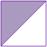 |
| **9** | Побудувати прямокутник розміром $N \times N$ із заповненням у правому нижньому куті (область, обмежена нижньою, правою сторонами та побічною діагоналлю: $row + col \ge N - 1$). | 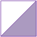 |
| **10** | Побудувати заповнений ромб (diamond), вершини якого лежать у центрах сторін квадрата $N \times N$ (для непарного $N$, умова манхеттенської відстані: $\vert{}i - c\vert{} + \vert{}col - c\vert{} \le c$, де $c = N / 2$). | 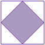 |

---

## Приклад виконання завдання

### 1. Умова завдання

**Базовий демонстраційний варіант**: Побудувати прямокутник розміром $N \times N$ із заповненням у лівому нижньому куті  (під головною діагоналлю, $row \le col$)). Розмір фігури ($N$ — висота/ширина або сторона квадрата) задається користувачем з клавіатури.  Фігура відображається у консолі за допомогою символу `*` (зірочка) для заповнених ділянок та пробілу `' '` для порожніх ділянок. Координатна сітка розглядається як матриця $N \times N$, де рядок $row \in [0, N-1]$, стовпець $col \in [0, N-1]$ (нумерація зверху вниз та зліва направо).

### 2. Аналіз умови та теоретичні відомості

Для побудови дискретного растрового зображення у текстовому терміналі використовується координатна сітка, що моделюється за допомогою двох вкладених циклів:

1. Зовнішній цикл перебирає рядки растра ($row$ від $0$ до $size - 1$) зверху вниз. Наприкінці кожного кроку зовнішнього циклу виконується перехід на новий рядок (`cout << endl;`).
2. Внутрішній цикл перебирає елементи поточного рядка — стовпці ($col$ від $0$ до $size - 1$) зліва направо.

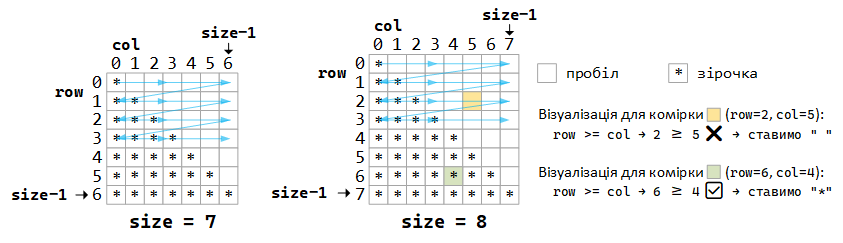

Математична закономірність:

- головна діагональ квадратної матриці складається з точок, для яких координата стовпця дорівнює номеру рядка:
$$col = row$$
- Область під головною діагоналлю (включаючи саму діагональ) — це лівий нижній трикутник. Для будь-якої точки цієї області номер стовпця не перевищує номер рядка:
$$col \le row$$
- Область над головною діагоналлю (правий верхній кут) визначається нерівністю:
$$col > row$$

Таким чином, для кожного знакомісця $(row, col)$ за допомогою умовного оператора `if-else` перевіряється умова $col \le row$: якщо вона істинна — друкується заповнювач "* ", інакше — порожнє місце "  ". Використання двох символів (зірочка з пробілом та два пробіли) компенсує вертикальну витягнутість символів стандартного консольного шрифту (співвідношення сторін знакомісця приблизно $2:1$) і робить фігуру візуально симетричною.

### 3. Схема алгоритму програми (Mermaid)

Схема алгоритму, виконана за допомогою мови розмітки mermaid:

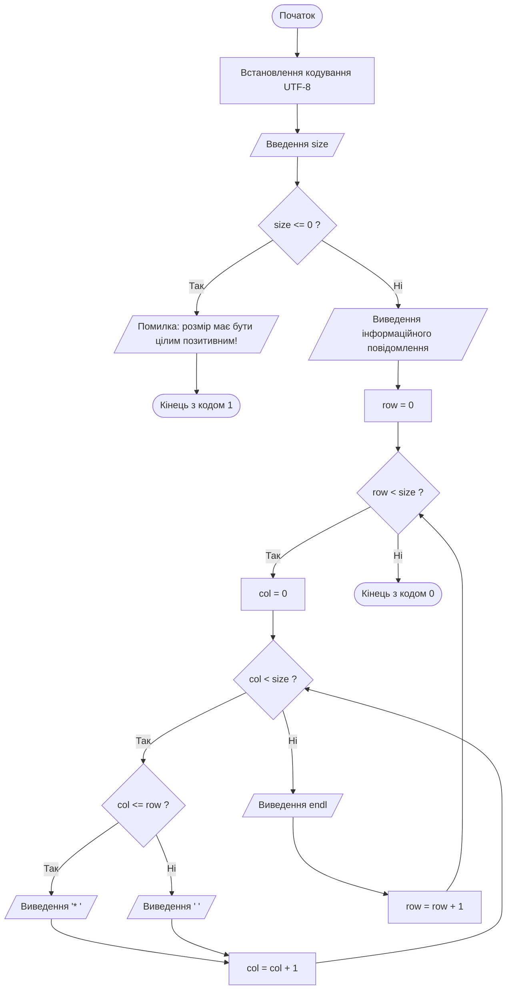

### 4. Програма на C++

Повна програма, що реалізує завдання.

```cpp
#include <iostream>
#include <windows.h> // для SetConsoleOutputCP

using namespace std;

int main() {
    
    // Перемикаємо консоль у UTF-8
    SetConsoleOutputCP(CP_UTF8);

    int size;

    cout << "Введіть розмір квадрата у символах (ціле число, більше за 0): ";
    //cout << "Enter size: ";
    cin >> size;

    if (size <= 0) {
        cout << "ПОМИЛКА: розмір квадрату має бути цілим позитивним числом!";
        return 1;
    }

    cout << "Будуємо квадрат розміром " << size << "x" << size;
    cout << " з заповненим трикутником під основною діагоналлю:" << endl;

    for (int row=0; row<size; row++) {
        for (int col=0; col<size; col++) {
            // координата стопця не більше координати рядка - 
            // ми знаходимось під головною діагоналлю або на ній
            if (col<=row) {
                cout << "* ";
            } else {
                cout << "  ";
            }
        }
        cout << endl;
    }

    return 0;
}
```

### 5. Пояснення принципів роботи програми

Програма функціонально розділена на три взаємопов'язані блоки:

1. **Блок ініціалізації та введення даних:**
    - Функція `SetConsoleOutputCP(CP_UTF8)` налаштовує консоль Windows на таблицю символів UTF-8 для коректного показу українських літер.
    - Оголошується цілочисельна змінна size, значення якої зчитується з потоку введення cin.
2. **Блок верифікації та обробки помилок:** умовний оператор `if (size <= 0)` перевіряє геометричний сенс вхідного значення. Якщо користувач ввів недодатне число ($0$ чи від'ємне значення), програма виводить діагностичне повідомлення про помилку та перериває роботу з ненульовим кодом завершення `1`.
3. **Блок графічної побудови (вкладені цикли):**
    - Зовнішній цикл `for (int row = 0; ...)` відповідає за зміну поточного рядка.
    - Внутрішній цикл `for (int col = 0; ...)` на кожній ітерації оцінює взаємне розташування індексів. Завдяки умові `if (col <= row)` у першому рядку ($row = 0$) виводиться $1$ зірочка, у другому ($row = 1$) — $2$ зірочки і так далі, аж до останнього рядка, який заповнюється повністю ($size$ зірочок).
    - Після завершення внутрішнього циклу команда `cout << endl;` переводить курсор на початок нового рядка екрана.

### 6. Приклад роботи програми в консолі

```bash
Введіть розмір квадрата у символах (ціле число, більше за 0): 5
Будуємо квадрат розміром 5x5 з заповненим трикутником під основною діагоналлю:
*          
* *        
* * *      
* * * *    
* * * * *
```

### 7. Тестування програми

Після написання програми її необхідно перевірити на декількох наборах вхідних даних. Для кожної лабораторної роботи рекомендується підготувати **5–7 тестових випадків**. Тестування повинно включати не тільки звичайні очікувані дані, а й спеціальні випадки.

Типи тестових випадків

| № тесту | Тип тесту | Вхідні дані | Очікуваний результат | Мета перевірки |
| :---: | :--- | :--- | :--- | :--- |
| **Тест 1** | Коректні дані (типовий випадок) | `size = 4` | Квадрат $4 \times 4$, у рядках відповідно 1, 2, 3 та 4 зірочки | Перевірка симетрії та відсутності зсуву рядків на парних розмірностях |
| **Тест 2** | Граничний випадок (мінімальний розмір) | `size = 1` | Виведення однієї зірочки: * | Перевірка коректності роботи циклів при $size = 1$ (вироджений квадрат $1 \times 1$). |
| **Тест 3** | Помилкові дані (нульове значення) | `size = 0` | Повідомлення: `ПОМИЛКА: розмір квадрату має бути цілим позитивним числом!` | Перевірка реакції валідатора на нульовий розмір (відсутність нескінченного циклу). |
| **Тест 4** | Помилкові дані (від'ємне число) | `size = -4` | Повідомлення: `ПОМИЛКА: розмір квадрату має бути цілим позитивним числом!` | Перевірка захисту від некоректних від'ємних геометричних параметрів. |
| **Тест 5** | Помилкові дані (нечислове значення) | `size = abc` | Повідомлення: `ПОМИЛКА: розмір квадрату має бути цілим позитивним числом!` | Перевірка захисту від некоректних (не числових) даних, які вводить користувач. |

## Приклад виконання завдання №2

### 1. Умова завдання №2

Розробити програму на мові С++, яка запитує у користувача розмір сторони квадрата $N$ - непарне число, $N \ge 5$, і виводить на екран **квадратну рамку з перехресними діагоналями та центральним заповненим ромбом** розміром $3 \times 3$. Якщо введено парне число або $N < 5$, програма повинна вивести зрозуміле повідомлення про помилку та завершити роботу.

### 2. Аналіз умови та теоретичні відомості для завдання №2

Для побудови двовимірного зображення у консолі використовується конструкція з двох вкладених циклів:

- **Зовнішній цикл** (по індексу рядка $row \in [0, N-1]$) керує позиціонуванням по вертикалі та переходом на новий рядок (`std::cout << '\n'`).
- **Внутрішній цикл** (по індексу стовпця $col \in [0, N-1]$) обробляє пікселі поточного рядка, аналізуючи координати $(row, col)$ і виводячи або символ фігури `'*'`, або символ фону `' '`.

#### Математична формалізація умов для завдання №2

1. **Зовнішній контур (рамка):**
   - Верхній та нижній рядки: $row = 0$ або $row = N - 1$.
   - Лівий та правий стовпці: $col = 0$ або $col = N - 1$.
2. **Головна діагональ:**
   - $row = col$.
3. **Побічна діагональ:**
   - $row + col = N - 1$.
4. **Центральний ромб (розміром $3 \times 3$):**
   - Координата центру квадрата: $center = N / 2$ (цілочисельне ділення).
   - Манхеттенська відстань від поточної точки $(i, col)$ до центру:
     $$\vert{}i - center\vert{} + \vert{}col - center\vert{} \le 1$$
     Для радіуса $R = 1$ ця умова задає 5 центральних точок у формі ромба.

Загальне правило виведення точки формується диз'юнкцією умов: якщо виконується бодай одна з них — виводиться символ `*`, інакше — пробіл.

### 3. Схема алгоритму програми (Mermaid) для завдання №2

Схема алгоритму, виконана за допомогою мови розмітки mermaid:

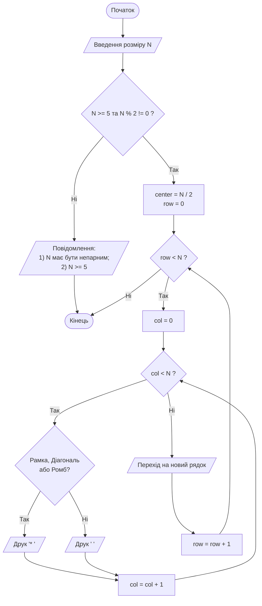

### 4. Програма на C++ для завдання №2

Повна програма, що реалізує завдання.

```cpp
#include <iostream>
#include <cmath>
#include <windows.h> // для SetConsoleOutputCP

int main() {
    // Встановлення української локалі для коректного виведення тексту
    // Перемикаємо консоль у UTF-8
    SetConsoleOutputCP(CP_UTF8);

    std::cout << "========================================================\n";
    std::cout << " Лабораторна робота №3. Приклад побудови псевдографіки\n";
    std::cout << " Рамка з діагоналями та центральним ромбом\n";
    std::cout << "========================================================\n\n";

    int N = 0;
    std::cout << "Введіть розмір сторони квадрата N (непарне число, N >= 5): ";
    if (!(std::cin >> N)) {
        std::cerr << "Помилка введення: введено неціле значення!\n";
        return 1;
    }

    // Валідація розмірності
    if (N < 5) {
        std::cout << "\nПомилка: Розмір N має бути не менше 5 для коректного відображення!\n";
        return 1;
    }

    if (N % 2 == 0) {
        std::cout << "\nПомилка: Розмір N повинен бути непарним для симетрії ромба!\n";
        return 1;
    }

    int center = N / 2;

    std::cout << "\nРезультат побудови фігури (N = " << N << "):\n\n";

    // Зовнішній цикл - перебір рядків (row)
    for (int row = 0; row < N; ++row) {
        // Внутрішній цикл - перебір стовпців (col)
        for (int col = 0; col < N; ++col) {
            // Перевірка геометричних критеріїв
            bool isBorder = (row == 0 || row == N - 1 || col == 0 || col == N - 1);
            bool isMainDiag = (row == col);
            bool isAntiDiag = (row + col == N - 1);
            bool isCenterDiamond = (std::abs(row - center) + std::abs(col - center) <= 1);

            if (isBorder || isMainDiag || isAntiDiag || isCenterDiamond) {
                std::cout << "* ";
            } else {
                std::cout << "  "; // Два пробіли для вирівнювання пропорцій символу '* '
            }
        }
        std::cout << '\n'; // Перехід на наступний рядок
    }

    std::cout << "\n========================================================\n";
    return 0;
}
```

### 5. Пояснення принципів роботи програми для завдання №2

Пояснення рішень, що були застосовані у програмі:

1. **Корекція пропорцій у консолі:** Символ моноширинного шрифту у терміналі по вертикалі зазвичай довший, ніж по горизонталі (співвідношення приблизно $2:1$). Додавання пробілу після зірочки (`"* "`) і використання двох пробілів для фону (`"  "`) забезпечує геометрично правильне квадратне відображення.
2. **Читабельність логіки:** Кожен елемент фігури винесено в окрему змінну типу `bool` (`isBorder`, `isMainDiag`, `isAntiDiag`, `isCenterDiamond`), що спрощує читання та налагодження коду.
3. **Використання метрики Манхеттена:** Вираз `std::abs(i - center) + std::abs(j - center) <= 1` компактно визначає координати клітинок симетричного ромба без потреби в додаткових умовних гілках.

### 6. Приклад роботи програми для завдання №2 в консолі

```bash
========================================================
 Лабораторна робота №3. Приклад побудови псевдографіки
 Рамка з діагоналями та центральним ромбом
========================================================

Введіть розмір сторони квадрата N (непарне число, N >= 5): 7

Результат побудови фігури (N = 7):

* * * * * * * 
* *       * * 
*   * * *   * 
*   * * *   * 
*   * * *   * 
* *       * * 
* * * * * * * 

========================================================
```

### 7. Тестування програми для завдання №2

Після написання програми її необхідно перевірити на декількох наборах вхідних даних. Для кожної лабораторної роботи рекомендується підготувати **5–7 тестових випадків**. Тестування повинно включати не тільки звичайні очікувані дані, а й спеціальні випадки.

Типи тестових випадків

| № тесту | Тип тесту | Вхідні дані | Очікуваний результат | Мета перевірки |
| :---: | :--- | :--- | :--- | :--- |
| **Тест 1** | Коректні дані (типовий випадок) | `N = 7` | Повна фігура $7 \times 7$ з рамкою, діагоналями та чітким центром | Перевірка базової симетрії, коректності накладання діагоналей і ромба. |
| **Тест 2** | Граничний випадок (мінімально допустимий розмір) | `N = 5` | Компактна фігура $5 \times 5$, де діагоналі торкаються центрального ромба | Перевірка граничного коректного розміру сітки. |
| **Тест 3** | Порушення вимоги парності | `N = 6` | Повідомлення про помилку: `Розмір N повинен бути непарним!` | Перевірка блокування некоректних парних значень, що порушують симетрію. |
| **Тест 4** | Некоректне граничне значення | `N = 2` (або `N = -3`) | Повідомлення про помилку: `Розмір N має бути не менше 5!` | Перевірка валідації діапазону та захисту від некоректного вводу. |
| **Тест 5** | Помилкові дані (нечислове значення) | `N = abc` | Повідомлення: `Помилка введення: введено неціле значення!` | Перевірка захисту від некоректних (не числових) даних, які вводить користувач. |

---

## Вимоги до звіту

За результатами виконання індивідуального варіанта завдання треба підготувати звіт, складений за встановленим шаблоном.

**Структура звіту:**

1. Титульний аркуш із зазначенням назви дисципліни, номера лабораторної роботи та її теми, навчальної групи та ПІБ студента.
2. Текст завдання відповідно до призначеного індивідуального варіанта (з точним описом умов та обмежень).
3. Теоретичні відомості та опис способу вирішення завдання:
    - математичні формули, визначення, позначення;
    - обґрунтування вибору операторів та конструкцій мови програмування;
    - опис алгоритму виведення позначки заповнення фігури, що визначена індивідуальним варіантом завдання.
4. Схема алгоритму програми, оформлена відповідно до стандартів (блок-схема) у графічному вигляді, або згенерована за допомогою мови опису діаграм Mermaid (код, що описує діаграму, теж треба додати у звіт).
5. Текст програми (лістинг коду). Обов'язкове оформлення моноширинним шрифтом (Courier New, Consolas, Lucida Console тощо). Наявність коментарів у ключових блоках коду (ініціалізація, цикл, логічні перевірки).
6. Перелік тестових випадків та результати їх виконання:
    - таблиця тестових наборів (не менше 5 варіантів, включаючи типові, межові та помилкові дані);
    - копії (знімки екрана / скріншоти) вікна командного рядка з реальними результатами запуску програми для кожного тесту.
7. Висновки (бажано), підсумок щодо досягнення мети роботи, особливості функціонування розробленої програми, виявлені обмеження або потенційні шляхи покращення.
