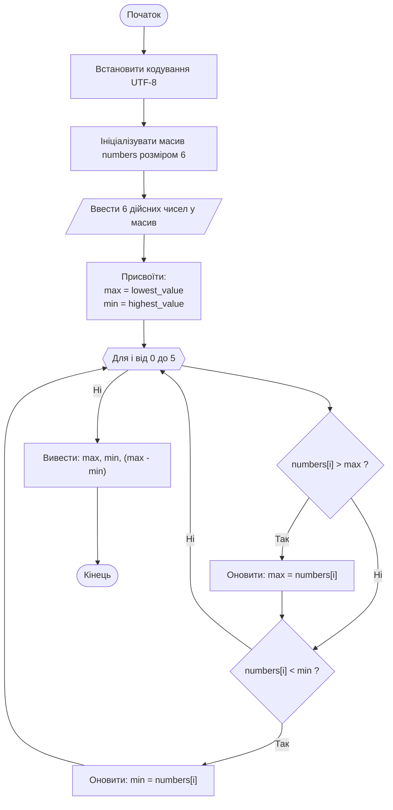

# Лабораторна робота №4. Опрацювання числових послідовностей та одновимірних масивів за допомогою циклу `for`

## Мета роботи

Набуття практичних навичок реалізації алгоритмів обробки скінченних числових послідовностей та одновимірних статичних масивів у мові C++; дослідження та реалізація типових обчислювальних схем накопичення (знаходження суми, добутку, середнього арифметичного, лічильників кількості за умовою), а також базових пошукових патернів (визначення мінімального та максимального елементів, аналіз сусідніх елементів послідовності).

## Задачі роботи

1. Опанувати синтаксис оголошення, ініціалізації та індексації одновимірних статичних масивів цілих і дійсних чисел (`int`, `double`, `float`).
2. Дослідити організацію циклічних обчислень за допомогою оператора `for` для послідовного введення та сканування елементів масиву.
3. Засвоїти коректні алгоритмічні підходи до пошуку екстремумів (мінімуму/максимуму) через безпечну ініціалізацію граничними значеннями з бібліотеки `<limits>` або значенням першого елемента масиву.
4. Реалізувати алгоритми умовної фільтрації та селективного накопичення (парність/непарність, кратність, перевірка потрапляння в числовий діапазон, порівняння з першим або попереднім елементом).
5. Навчитися будувати графічні схеми алгоритмів за стандартом у нотації Mermaid.
6. Скласти план тестування та перевірити коректність програми щонайменше на 5–6 характерних тестових наборах (зокрема з від’ємними числами, однаковими значеннями та нулями).

## Перелік індивідуальних варіантів завдання

Лабораторна робота містить завдання двох рівнів складності. Номер індивідуального варіанта завдання призначається викладачем.

### Таблиця 1 — Базовий рівень (Фіксована розмірність послідовності)

| № | Індивідуальне завдання |
| ---: | :--- |
| 1 | Ввести 7 дійсних чисел та обчислити добуток елементів цієї послідовності, значення яких менше за 6. |
| 2 | Ввести 10 дійсних чисел та обчислити кількість додатних елементів. |
| 3 | Ввести 6 дійсних чисел та обчислити суму від'ємних елементів. |
| 4 | Ввести 5 дійсних чисел і визначити найменше та найбільше серед них. |
| 5 | Ввести 8 дійсних чисел та обчислити середнє арифметичне ненульових елементів. |
| 6 | Ввести 9 дійсних чисел та обчислити суму елементів, абсолютне значення яких не перевищує 5. |
| 7 | Ввести 11 дійсних чисел та обчислити кількість елементів послідовності, значення яких більше за значення першого елемента. |
| 8 | Ввести 6 дійсних чисел та обчислити добуток елементів послідовності, значення яких перебувають у діапазоні $[3, 6]$. |
| 9 | Ввести 8 дійсних чисел та обчислити середнє арифметичне додатних елементів. |
| 10 | Ввести 7 дійсних чисел та обчислити суму квадратів тих чисел, модуль яких не перевищує 3. |
| 11 | Ввести 14 цілих чисел та обчислити кількість ненульових елементів. |
| 12 | Ввести 9 дійсних чисел та визначити мінімальний елемент послідовності. |
| 13 | Ввести 6 цілих чисел та обчислити добуток ненульових елементів. |
| 14 | Ввести 10 цілих чисел та обчислити середнє арифметичне елементів послідовності, значення яких перебувають у діапазоні $[10, 20]$. |
| 15 | Ввести 8 дійсних чисел та обчислити кількість елементів, значення яких перебувають у діапазоні $[5, 10]$. |
| 16 | Ввести 7 цілих чисел та визначити суму модулів усіх від'ємних елементів. |
| 17 | Ввести 9 дійсних чисел та обчислити добуток додатних елементів, значення яких не перевищує 4. |
| 18 | Ввести 12 дійсних чисел та обчислити кількість додатних і кількість від'ємних елементів послідовності. |
| 19 | Ввести 8 цілих чисел та обчислити середнє арифметичне абсолютних (за модулем) значень усіх елементів послідовності. |
| 20 | Ввести 6 дійсних чисел, віднайти максимальний і мінімальний елементи та визначити, наскільки максимальний елемент є більшим за мінімальний. *(Розв'язано як демонстраційний приклад).* |
| 21 | Ввести 11 цілих чисел та обчислити суму тільки двоцифрових елементів. |
| 22 | Ввести 9 цілих чисел та обчислити добуток непарних елементів. |
| 23 | Ввести 14 цілих чисел та обчислити кількість елементів, кратних числу 3. |
| 24 | Ввести 7 цілих чисел та обчислити середнє арифметичне парних елементів. |
| 25 | Ввести 6 дійсних чисел та обчислити суму елементів, значення яких менше за значення першого елемента послідовності. |

### Таблиця 2 — Середній рівень (Динамічний аналіз та зв'язки між елементами)

> **Примітка:** Розмірність послідовності $N$ ($N \ge 2$) вводиться користувачем з консолі на початку роботи програми.

| № | Індивідуальне завдання |
| ---: | :--- |
| 1 | Ввести послідовність дійсних чисел та обчислити кількість елементів, які більші за попередній елемент послідовності. |
| 2 | Ввести послідовність дійсних чисел та обчислити суму лише тих елементів цієї послідовності, значення яких менші за перший елемент. |
| 3 | Ввести послідовність дійсних чисел та перевірити, чи є вона упорядкованою за спаданням. |
| 4 | Ввести послідовність натуральних чисел $(a_1, a_2, \dots, a_n)$ та обчислити $\min(a_1 + a_2, a_2 + a_3, \dots, a_{n-1} + a_n)$. |
| 5 | Ввести послідовність цілих чисел та визначити різницю між найменшим і першим числами послідовності. |
| 6 | Ввести послідовність дійсних чисел $(a_1, a_2, \dots, a_n)$ та обчислити $\min(a_1, a_3, a_5, \dots) + \max(a_2, a_4, a_6, \dots)$. |
| 7 | Ввести послідовність дійсних чисел $(a_1, a_2, \dots, a_n)$ та обчислити $\max(\vert a_1 - a_2\vert , \vert a_2 - a_3\vert , \dots, \vert a_{n-1} - a_n\vert )$. |
| 8 | Ввести послідовність цілих чисел та визначити різницю між найбільшим і першим числами послідовності. |
| 9 | Ввести послідовність дійсних чисел $(a_1, a_2, \dots, a_n)$ та обчислити $a_1 a_2 + a_2 a_3 + \dots + a_{n-1} a_n$. |
| 10 | Ввести послідовність дійсних чисел $(a_1, a_2, \dots, a_n)$ та обчислити $(a_2 - a_1)(a_3 - a_2)\dots(a_n - a_{n-1})$. |
| 11 | Ввести послідовність дійсних чисел та обчислити середнє арифметичне елементів послідовності, значення яких менші за перший елемент. |
| 12 | Ввести послідовність цілих чисел та перевірити, чи є в ній однакові сусідні числа. |
| 13 | Ввести послідовність цілих чисел та з'ясувати, чи утворюють числа зростаючу послідовність. |
| 14 | Ввести послідовність цілих чисел та визначити різницю між найбільшим і найменшим числами послідовності. |
| 15 | Ввести послідовність натуральних чисел та обчислити кількість і суму тих членів послідовності, які діляться на 5 і не діляться на 7. |
| 16 | Ввести послідовність натуральних чисел та обчислити подвоєну суму всіх додатних членів послідовності. |
| 17 | Ввести послідовність дійсних чисел та обчислити суму від'ємних і кількість додатних елементів послідовності. |
| 18 | Ввести послідовність дійсних чисел та віднайти два сусідні елементи, які за значенням є найближчими (різниця між якими за модулем є найменшою). |
| 19 | Ввести послідовність цілих чисел та обчислити відсотковий вміст від'ємних, нульових та додатних чисел. |
| 20 | Ввести послідовність цілих чисел та перевірити, чи є в ній числа, значення яких збігається з першим елементом послідовності (окрім самого першого). |
| 21 | Ввести послідовність натуральних чисел та визначити порядковий номер першого нульового елемента (якщо він є). |
| 22 | Ввести послідовність натуральних чисел та обчислити кількість членів послідовності, які мають парні індекси і є непарними числами. |
| 23 | Ввести послідовність дійсних чисел та обчислити суму квадратів лише тих елементів, значення яких менші за перший елемент. |
| 24 | Ввести послідовність натуральних чисел та обчислити кількість трицифрових чисел. |
| 25 | Ввести послідовність цілих чисел та обчислити суму елементів, розташованих до першого від'ємного значення. |

## Приклад виконання завдання

### 1. Умова завдання

Ввести 6 дійсних чисел, віднайти максимальний і мінімальний елементи та визначити, наскільки максимальний елемент є більшим за мінімальний.

### 2. Аналіз умови та теоретичні відомості

1. **Оголошення масиву фіксованого розміру.** У C++ статичний одновимірний масив дійсних чисел подвійної точності оголошується за допомогою конструкції:

    ```cpp
    const int size = 6;
    double numbers[size];
    ```

    Індексація елементів починається з `0` і закінчується індексом `size - 1`. Доступ до елемента здійснюється через оператор прямого доступу: `numbers[i]`.

2. **Введення даних.** Зчитування значень реалізується оператором циклу `for (int i = 0; i < size; ++i)`, де на кожному кроці чергове число записується з консольного потоку `cin >> numbers[i]`.

3. **Коректна ініціалізація екстремумів.** Для гарантованого знаходження максимуму та мінімуму серед довільних дійсних чисел (зокрема суто від’ємних):

   - змінній `max` присвоюють найменше можливе представлене значення відповідного типу: `numeric_limits<double>::lowest()`;
   - змінній `min` присвоюють найбільше можливе додатне значення типу: `numeric_limits<double>::max()`.

   *Альтернативний підхід:* ініціалізувати `max = numbers[0]` та `min = numbers[0]`, після чого виконувати ітерації, починаючи з індексу `i = 1`.

4. **Пошук та обчислення різниці.** Проходом по масиву у циклі `for` кожен елемент `numbers[i]` порівнюється з поточними `max` та `min`. Якщо поточний елемент перевищує `max`, значення оновлюється. Аналогічно для `min`. Різниця визначається простою арифметичною дією:
   $$\Delta = max - min$$

### 3. Схема алгоритму програми (Mermaid)

Схема алгоритму, виконана за допомогою мови розмітки mermaid:



### 4. Програма на C++

Повна програма, що реалізує завдання.

```cpp
#include <iostream>
#include <limits>
#include <windows.h> // для SetConsoleOutputCP

using namespace std;

int main() {
    // Перемикаємо консоль у UTF-8 для коректного виведення кирилиці
    SetConsoleOutputCP(CP_UTF8);
    
    // Створення масиву фіксованої розмірності
    const int size = 6;
    double numbers[size];

    // Введення 6 дійсних чисел користувачем
    cout << "Введіть 6 дійсних чисел:\n";
    for (int i = 0; i < size; ++i) {
        cin >> numbers[i];
    }

    // Ініціалізація максимального і мінімального значення
    double max = numeric_limits<double>::lowest();
    double min = numeric_limits<double>::max();

    // Знаходження максимального і мінімального елементів масиву
    for (int i = 0; i < size; ++i) {
        if (numbers[i] > max) {
            max = numbers[i];
        }
        if (numbers[i] < min) {
            min = numbers[i];
        }
    }

    // Виведення обчислених результатів
    cout << "\n--- Результати обробки послідовності ---\n";
    cout << "Максимальний елемент: " << max << endl;
    cout << "Мінімальний елемент: " << min << endl;
    cout << "Максимальний елемент більший за мінімальний на: " << (max - min) << endl;

    return 0;
}
```

### 5. Пояснення принципів роботи програми

Робота програми складається з чотирьох основних етапів:

1. **Налаштування середовища, оголошення змінних та констант:**  
   Виклик `SetConsoleOutputCP(CP_UTF8)` забезпечує відображення україномовного тексту в терміналі. Константа `size = 6` визначає довжину масиву `numbers`, виділяючи блок неперервної пам'яті під 6 значень типу `double`.
2. **Введення даних:**  
   Перший цикл `for` послідовно зчитує 6 чисел із потоку `cin` та заносить їх у відповідні комірки масиву від індексу `0` до `5`.
3. **Пошук екстремумів (порівняння та оновлення):**  
   Змінні `max` та `min` ініціалізуються максимальним та мінімальним можливим значенням типу `double` відповідно. Другий цикл `for` виконує повне сканування масиву. Якщо поточне число більше за `max`, значення `max` перезаписується. Якщо воно менше за `min`, оновлюється `min`.
4. **Обчислення та формування виведення:**  
   Обчислюється різниця `(max - min)`, після чого всі три отримані величини виводяться в консоль.

### 6. Приклад роботи програми в консолі

```cmd
Введіть 6 дійсних чисел:
4.5 -1.2 8.0 0 12.3 -5.5

--- Результати обробки послідовності ---
Максимальний елемент: 12.3
Мінімальний елемент: -5.5
Максимальний елемент більший за мінімальний на: 17.8
```

### 7. Тестування програми

Для забезпечення надійності та всебічної перевірки алгоритму розроблено набір із 6 тестових випадків:

| № тесту | Тип тесту | Вхідні дані (6 чисел) | Очікуваний результат | Мета перевірки |
| :---: | :--- | :--- | :--- | :--- |
| **Тест 1** | Стандартний (додатні дійсні) | `1.5  4.2  10.0  3.1  8.4  2.0` | Max: 10, Min: 1.5, Різниця: 8.5 | Перевірка базової роботи на додатних дійсних числах. |
| **Тест 2** | Змішані числа (від'ємні, 0, додатні) | `4.5  -1.2  8.0  0.0  12.3  -5.5` | Max: 12.3, Min: -5.5, Різниця: 17.8 | Коректне визначення знаків, від'ємного мінімуму та обчислення різниці. |
| **Тест 3** | Суто від'ємні значення | `-10.5  -20.0  -3.2  -8.1  -15.0  -2.5` | Max: -2.5, Min: -20.0, Різниця: 17.5 | Перевірка пошуку максимуму, коли всі числа від'ємні (критично для ініціалізації lowest). |
| **Тест 4** | Усі елементи однакові | `7.0  7.0  7.0  7.0  7.0  7.0` | Max: 7.0, Min: 7.0, Різниця: 0.0 | Граничний випадок відсутності розкиду значень, різниця повинна дорівнювати 0. |
| **Тест 5** | Екстремуми на межах масиву | `-100.0  1.0  2.0  3.0  4.0  50.0` | Max: 50.0, Min: -100.0, Різниця: 150.0 | Перевірка відсутності помилок індексації "off-by-one" (на нульовому та останньому елементах). |
| **Тест 6** | Числа з великою точністю | `0.0001  0.0009  0.0003  0.0002  0.0005  0.0004` | Max: 0.0009, Min: 0.0001, Різниця: 0.0008 | Перевірка чутливості алгоритму до чисел, близьких до нуля. |

### 8. Зауваження щодо обраних підходів до реалізації

Розглянемо реалізацію алгоритму з прикладу покроково, щоб перевірити її математичну та алгоритмічну коректність:

1. Відсутність валідації вводу: якщо користувач замість числа введе літеру, потік `cin` перейде у стан помилки (`failbit`), подальші елементи залишаться неініціалізованими або заповненими сміттям, що призведе до спотвореного результату.
2. Ініціалізація екстремумів у вигляді:

    ```cpp
    double max = numeric_limits<double>::lowest();
    double min = numeric_limits<double>::max();
    ```

    Для дійсних чисел типу double використання `lowest()` та `max()` є стандартом C++ і гарантує коректне встановлення границь навіть для суто від'ємних чисел. Проте, зазвичай для масивів вважається більш надійним і простим стилем брати початкові значення як `max = numbers[0]` та `min = numbers[0]` (тоді відпадає потреба підключати `<limits>`).
3. Два окремі проходи замість одного: масив спочатку заповнюється в одному циклі, а потім знову обходиться у другому. Це допустимо з навчальною метою (демонстрація роботи з масивами), але на практиці пошук можна поєднати безпосередньо з вводом або оптимізувати прохід.

Основна математична та логічна частина програми розв'язана коректно, але код має недолік у відсутності перевірки коректності введених даних користувачем.

Нижче наведено вдосконалену версію, яка:

1. Захищає програму від некоректного вводу (букви, символи).
2. Використовує природну ініціалізацію першим елементом масиву `numbers[0]`, що спрощує код та уникає зайвих залежностей.
3. Додає форматування виводу дійсних чисел.

```cpp
#include <iostream>
#include <windows.h> // для SetConsoleOutputCP

using namespace std;

int main() {
    // Налаштовуємо виведення українських символів у консолі Windows
    SetConsoleOutputCP(CP_UTF8);

    const int size = 6;
    double numbers[size];

    cout << "Введіть 6 дійсних чисел (через пробіл або Enter):\n";
    for (int i = 0; i < size; ++i) {
        if (!(cin >> numbers[i])) {
            cerr << "Помилка: введено некоректні дані! Очікувалося дійсне число.\n";
            return 1;
        }
    }

    // Ініціалізуємо екстремуми першим фактично введеним числом
    double max = numbers[0];
    double min = numbers[0];

    // Пошук починаємо з другого елемента (індекс 1)
    for (int i = 1; i < size; ++i) {
        if (numbers[i] > max) {
            max = numbers[i];
        }
        if (numbers[i] < min) {
            min = numbers[i];
        }
    }

    // Виведення результатів
    cout << "\n--- Результати обробки ---\n";
    cout << "Максимальний елемент: " << max << "\n";
    cout << "Мінімальний елемент: " << min << "\n";
    cout << "Максимальний елемент більший за мінімальний на: " << (max - min) << "\n";

    return 0;
}
```

## Приклад виконання завдання №2 (середній рівень)

### 1. Умова завдання №2

Ввести послідовність із $N$ дійсних чисел ($N \ge 2$). Обчислити мінімальну та максимальну абсолютну різницю між сусідніми елементами послідовності:
$$\min(\vert{}a_1 - a_2\vert{}, \vert{}a_2 - a_3\vert{}, \dots, \vert{}a_{n-1} - a_n\vert{})$$
$$\max(\vert{}a_1 - a_2\vert{}, \vert{}a_2 - a_3\vert{}, \dots, \vert{}a_{n-1} - a_n\vert{})$$
Визначити, на скільки максимальна різниця перевищує мінімальну, а також з'ясувати, чи є введена послідовність строго монотонно зростаючою.

### 2. Аналіз умови та теоретичні відомості для завдання №2

1. Динамічний розмір массиву ($N \ge 2$): кількість елементів не зафіксована наперед, а вводиться користувачем з обов'язковою перевіркою коректності.
2. Парний зв'язок між сусідами ($a_i$ та $a_{i-1}$): обчислюється не характеристика одного числа, а метрика відношення двох суміжних значень.
3. Захист від виходу за межі діапазону: Цикл аналізу пар ітерується до $N - 1$, оскільки для $N$ чисел існує рівно $N - 1$ сусідня пара.
4. Коректна ініціалізація екстремумів: Значення `minDiff` та `maxDiff` ініціалізуються різницею першої пари $\vert{}a_0 - a_1\vert{}$, що виключає хибні спрацьовування.
5. Аналіз структури послідовності (булевий предикат): Одночасно перевіряється умова строгого зростання ($a_i > a_{i-1}$) за допомогою логічного прапорця.

### 3. Схема алгоритму програми (Mermaid) для завдання №2

Схема алгоритму, виконана за допомогою мови розмітки mermaid:

```mermaid
flowchart TD
    Start([Початок]) --> SetCP[Встановити кодування UTF-8]
    SetCP --> InputN[/Ввести N/]
    InputN --> CheckN{N >= 2 ?}
    
    CheckN -- Ні --> ErrMsg[/Помилка: N має бути не менше 2!/]
    ErrMsg --> Stop1([Кінець з кодом 1])
    
    CheckN -- Так --> InputArr[/Ввести N дійсних чисел у масив a/]
    InputArr --> Init[firstDiff = |a0 - a1|<br>minDiff = firstDiff<br>maxDiff = firstDiff<br>isIncreasing = true<br>i = 1]
    
    Init --> LoopCond{i < N ?}
    
    LoopCond -- Так --> CheckInc{a[i] > a[i-1] ?}
    CheckInc -- Ні --> SetFalse[isIncreasing = false]
    CheckInc -- Так --> CalcDiff[diff = |a[i-1] - a[i]|]
    SetFalse --> CalcDiff
    
    CalcDiff --> CheckMax{diff > maxDiff ?}
    CheckMax -- Так --> UpdateMax[maxDiff = diff]
    CheckMax -- Ні --> CheckMin{diff < minDiff ?}
    UpdateMax --> CheckMin
    
    CheckMin -- Так --> UpdateMin[minDiff = diff]
    CheckMin -- Ні --> IncI[i = i + 1]
    UpdateMin --> IncI
    IncI --> LoopCond
    
    LoopCond -- Ні --> PrintRes[/Вивести minDiff, maxDiff, (maxDiff - minDiff), isIncreasing/]
    PrintRes --> Stop0([Кінець])
```

### 4. Програма на C++ для завдання №2

```cpp
#include <iostream>
#include <vector>
#include <cmath>
#include <windows.h> // для SetConsoleOutputCP

using namespace std;

int main() {
    // Налаштовуємо виведення українських символів у консолі Windows
    SetConsoleOutputCP(CP_UTF8);

    int n = 0;
    cout << "Введіть кількість елементів послідовності (N >= 2): ";
    if (!(cin >> n) || n < 2) {
        cerr << "Помилка: кількість елементів має бути цілим числом, не меншим за 2!\n";
        return 1;
    }

    // Динамічний вектор для збереження N елементів
    vector<double> a(n);
    cout << "Введіть " << n << " дійсних чисел:\n";
    for (int i = 0; i < n; ++i) {
        if (!(cin >> a[i])) {
            cerr << "Помилка введення елемента послідовності!\n";
            return 1;
        }
    }

    // Початкова ініціалізація екстремумів різницею першої пари (|a[0] - a[1]|)
    double firstDiff = abs(a[0] - a[1]);
    double minDiff = firstDiff;
    double maxDiff = firstDiff;

    // Прапорець для перевірки строгого зростання послідовності
    bool isIncreasing = true;

    // Аналіз сусідніх елементів починаючи з другої пари
    for (int i = 1; i < n; ++i) {
        // Перевірка монотонного зростання
        if (a[i] <= a[i - 1]) {
            isIncreasing = false;
        }

        // Обчислення абсолютної різниці поточної сусідньої пари
        double currentDiff = abs(a[i - 1] - a[i]);
        if (currentDiff > maxDiff) {
            maxDiff = currentDiff;
        }
        if (currentDiff < minDiff) {
            minDiff = currentDiff;
        }
    }

    // Виведення результатів аналізу
    cout << "\n--- Результати аналізу послідовності ---\n";
    cout << "Мінімальна різниця між сусідами: " << minDiff << "\n";
    cout << "Максимальна різниця між сусідами: " << maxDiff << "\n";
    cout << "Максимальна різниця більша за мінімальну на: " << (maxDiff - minDiff) << "\n";
    cout << "Чи є послідовність строго зростаючою: " 
         << (isIncreasing ? "Так" : "Ні") << "\n";

    return 0;
}
```

### 5. Пояснення принципів роботи програми для завдання №2

Пояснення рішень, що були застосовані у програмі:

1. Контейнер `std::vector<double> a(n)`: виділяє потрібний обсяг пам'яті під довільне значення $N$, введене користувачем під час виконання програми.
2. Безпечна ініціалізація `firstDiff`: екстремуми прив'язуються до реальних значень першої пари $\vert{}a_0 - a_1\vert{}$, що унеможливлює ситуацію з невірним початковим нулем чи штучними константами.
3. Єдиний прохід (*Single Pass*): за один цикл `for (int i = 1; i < n; ++i)` одночасно оновлюються екстремуми різниць та верифікується предикат сортування.

### 6. Приклад роботи програми в консолі для завдання №2

```cmd
Введіть кількість елементів послідовності (N >= 2): 5
Введіть 5 дійсних чисел:
2.3 -4.2 1.78 3 10.1

--- Результати аналізу послідовності ---
Мінімальна різниця між сусідами: 1.22
Максимальна різниця між сусідами: 7.1
Максимальна різниця більша за мінімальну на: 5.88
Чи є послідовність строго зростаючою: Ні
```

### 7. Тестування програми для завдання №2

| № тесту | Тип тесту | "Вхідні дані (N, числа)" | Очікуваний результат | Мета перевірки |
| :---: | :--- | :--- | :--- | :--- |
| Тест 1 | Строго зростаюча послідовність | `N = 4` `1.0  3.5  4.0  10.0` | "Min: 0.5, Max: 6.0, Різниця: 5.5 Зростаюча: Так" | Перевірка базового розрахунку різниць пар та детекції зростання. |
| Тест 2 | Порушення монотонності | `N = 4` `5.0  2.0  8.0  1.0` | "Min: 3.0, Max: 7.0, Різниця: 4.0 Зростаюча: Ні" | Робота з чергуванням знаків приросту та коректне встановлення прапорця `false`. |
| Тест 3 | Мінімальний розмір (N=2) | `N = 2` `-4.5  6.5` | "Min: 11.0, Max: 11.0, Різниця: 0.0 Зростаюча: Так" | Граничний випадок мінімальної допустимої кількості елементів (одна пара). |
| Тест 4 | Усі числа однакові (плата) | `N = 3` `2.0  2.0  2.0` | "Min: 0.0, Max: 0.0, Різниця: 0.0 Зростаюча: Ні" | Перевірка суворості умови зростання ($a_i​>a_{i−1}$​) при нульових різницях. |
| Тест 5 | Некоректний розмір послідовності | `N = 1` або `N = -3` | Повідомлення про помилку: `Помилка: кількість елементів має бути ... не меншою за 2!` | Перевірка вхідного валідатора на неможливість утворення пар сусідів. |

## Вимоги до звіту

За результатами виконання індивідуального варіанта завдання треба підготувати звіт, складений за встановленим шаблоном.

**Структура звіту:**

1. Титульний аркуш із зазначенням назви дисципліни, номера лабораторної роботи та її теми, навчальної групи та ПІБ студента.
2. Текст завдання відповідно до призначеного індивідуального варіанта (з точним описом умов та обмежень).
3. Теоретичні відомості та опис способу вирішення завдання:
    - спосіб організації даних у пам'яті (оголошення типу і розміру масиву);
    - математичні вирази та умови фільтрації даних;
    - обґрунтування правил початкової ініціалізації змінних накопичення та екстремумів.
4. Схема алгоритму програми, оформлена відповідно до стандартів (блок-схема) у графічному вигляді, або згенерована за допомогою мови опису діаграм Mermaid (код, що описує діаграму, теж треба додати у звіт).
5. Текст програми (лістинг коду). Обов'язкове оформлення моноширинним шрифтом (*Courier New*, *Consolas*, *Lucida Console* тощо). Наявність коментарів у ключових блоках коду (ініціалізація, цикл, логічні перевірки).
6. Перелік тестових випадків та результати їх виконання:
    - таблиця тестових наборів (не менше 5 варіантів, включаючи типові, межові та помилкові дані);
    - копії вікна командного рядка (знімки екрана / скріншоти) з реальними результатами запуску програми для кожного тесту.
7. Висновки (бажано), підсумок щодо досягнення мети роботи, особливості функціонування розробленої програми, виявлені обмеження або потенційні шляхи покращення.
